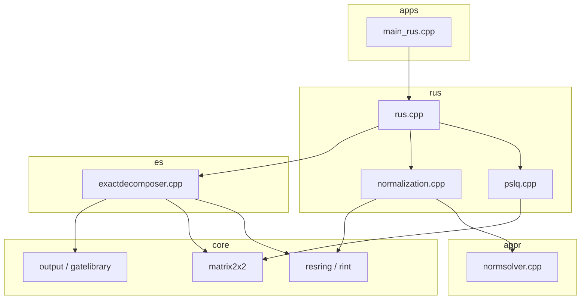

# RUS Project File Layout

> **Path:** `SliQSim/external/rus`
>
> This document describes each directory and file group. Algorithm modules keep the original SQCT layout; shared code formerly at the repo root lives under `core/`.

---

## Directory Overview

```
external/rus/
├── apps/          # Executable entry points (main)
├── core/          # Shared library (rings, matrices, circuit I/O, utilities)
├── rus/           # RUS algorithm (PSLQ → Normalization → synthesis)
├── appr/          # Single-qubit unitary approximation
├── es/            # Exact Clifford+T synthesis
├── sk/            # Solovay–Kitaev (retained; not linked into rusSyn)
├── theory/        # Paper numerical verification (not linked into rusSyn)
├── ttmath/        # Third-party big-integer library
├── docs/          # Project documentation
├── output/        # QASM produced by rusSyn (runtime output)
├── tests/         # Mathematica notebooks and intermediate results
├── build/         # Recommended out-of-source build directory (optional)
└── (root)         # CMake, licenses, README
```

---

## 1. `apps/` — Entry Points

| File | Status | Description |
|------|--------|-------------|
| `main_rus.cpp` | **Active** | `rusSyn` main: CLI, calls `RUS::run()`, writes QASM |
| `main.cpp` | Retained | Original `sqctSK` entry (commented out in CMake) |
| `mainA.cpp` | Retained | Original `sqct` entry (commented out in CMake) |

---

## 2. `core/` — Shared Library

Used by `rusSyn` and multiple algorithm modules.

### 2.1 Rings and Linear Algebra

| File | Description |
|------|-------------|
| `resring.cpp/h` | Mod-8 residue ring `resring<8>` for exact decompose |
| `rint.cpp/h` | `ring_int` arithmetic and Galois conjugation |
| `matrix2x2.cpp/h` | 2×2 matrices (unitary representation) |
| `vector2.cpp/h` | 2D vectors |

### 2.2 Circuits and Output

| File | Description |
|------|-------------|
| `gatelibrary.cpp/h` | Clifford+T gate definitions (H, T, S, …) |
| `output.cpp/h` | Circuit data structures, `QasmGenerator` |
| `symbolic_angle.cpp/h` | Symbolic angle handling |

### 2.3 High Precision and Numerics

| File | Description |
|------|-------------|
| `hprhelpers.cpp/h` | High-precision complex helpers |
| `fixedpoint.cpp/h` | Fixed-point arithmetic (uses `ttmath/`) |
| `real.hpp` | MPFR high-precision real wrapper |
| `mpfr_header_wrapper.hpp` | MPFR header compatibility layer |

### 2.4 Utilities and Test Helpers

| File | Description |
|------|-------------|
| `factorzs2.cpp/h` | Factorization in Z[√2] (via PARI norm solver) |
| `solvenormequation.cpp/h` | Norm-equation solver CLI logic |
| `tcount.cpp/h` | T-count statistics |
| `test.cpp/h` | Unit tests and dev checks |
| `requestprocessor.cpp/h` | Legacy request handler (still in rusSyn build) |
| `serializers.h` | Serialization helpers |
| `timemeasurement.h` | Timing macros |

---

## 3. `rus/` — RUS Algorithm

Repeat-Until-Success pipeline from [arXiv:1409.3552](https://arxiv.org/abs/1409.3552).

| File | Stage | Description |
|------|-------|-------------|
| `rus.cpp/h` | Orchestration | `RUS::run()`: PSLQ → Normalization → Decomposition |
| `pslq.cpp/h` | Stage 1 | PSLQ integer-relation search; collects `OmegaRing` candidates |
| `normalization.cpp/h` | Stage 2 | Normalizes candidates to 2×2 integer matrices |
| `matrix.cpp/h` | Shared | Matrix ops for RUS |
| `numeric_definition.h` | Shared | Type aliases (`real_t`, `int_t`, …) |

**Data flow:**

```
theta → PSLQ → [OmegaRing candidates...] → Normalization → matrix2x2 → exactDecomposer → circuit → QASM
```

---

## 4. `appr/` — Single-Qubit Unitary Approximation

Optimal rotation rounding and norm equations; RUS Normalization depends on `normsolver`.

| File | Description |
|------|-------------|
| `normsolver.cpp/h` | PARI-backed Z[√2] norm solver (**singleton** `instance()`) |
| `toptzrot2.cpp/h` | Optimal Z-rotation synthesis |
| `zrot_cache.cpp/h` | Rotation cache |
| `approxlist.cpp/h` | Approximation candidate lists |
| `findhalves.cpp/h` | Half-angle search |
| `rcup.cpp/h` | RCUP algorithm |
| `cup.cpp/h` | CUP algorithm |
| `topt-bfs.cpp/h` | T-optimal BFS |
| `observations.cpp/h` | Experimental observation utilities |

---

## 5. `es/` — Exact Synthesis

| File | Description |
|------|-------------|
| `exactdecomposer.cpp/h` | Decomposes normalized matrix to Clifford+T circuit (RUS Stage 3) |
| `seqlookupcliff.cpp/h` | Clifford sequence lookup |
| `optsequencegenerator.cpp/h` | Optimal sequence generation |
| `numbersgen.cpp/h` | Number generation for synthesis |

---

## 6. `sk/` — Solovay–Kitaev

**Not linked into `rusSyn`**; original SQCT SK pipeline retained in the repo.

| File | Description |
|------|-------------|
| `sk.cpp/h` | SK main flow |
| `unitaryapproximator.cpp/h` | Unitary approximation |
| `epsilonnet.cpp/h` | ε-net construction |
| `netgenerator.cpp/h` | Net generator |
| `gcommdecomposer.cpp/h` | Group commutator decomposition |
| `vector3hpr.cpp/h` | 3D high-precision vectors |

---

## 7. `theory/` — Paper Verification

**Not linked into `rusSyn`**; numerical checks for arXiv:1206.5236.

| File | Description |
|------|-------------|
| `theoremverification.cpp/h` | Theorem verification |
| `toptimalitytest.cpp/h` | T-optimality tests |
| `hoptimalitytest.cpp/h` | H-optimality tests |
| `numbers-stat.cpp/h` | Number statistics |

---

## 8. `ttmath/` — Third-Party Library

[TOMES / ttmath](https://www.ttmath.org/) big integer and floating-point code.

| Content | Description |
|---------|-------------|
| `ttmath.h`, etc. | Header-only core |
| `samples/` | Upstream examples (not project build targets) |

Used mainly via `core/fixedpoint.h`.

---

## 9. `docs/` — Documentation

| File | Description |
|------|-------------|
| `STRUCTURE.md` | This file: directory layout |
| `RUS_SEGFAULT_FIX.md` | rusSyn segfault fix log |

---

## 10. `output/` — Runtime Output

| Content | Description |
|---------|-------------|
| `*.qasm` | Quantum circuits from `rusSyn -O ...` |
| `.gitkeep` | Keeps empty directory in git |

Relative `-O` paths default here (see `apps/main_rus.cpp`).

---

## 11. `tests/` — Research Notebooks

| File | Description |
|------|-------------|
| `*.nb` | Mathematica notebooks (intermediate results, post-processing examples) |

---

## 12. Root Files

| File | Description |
|------|-------------|
| `CMakeLists.txt` | Build config (currently builds `rusSyn` only) |
| `README.md` | Build and usage |
| `COPYING` / `COPYING.LESSER` | LGPL license |
| `Doxyfile` | Doxygen config |
| `.gitignore` | Ignores build artifacts, `output/*`, etc. |
| `.github/workflows/` | CI (publish) |

**Build artifacts (ignore, do not commit):** `CMakeCache.txt`, `CMakeFiles/`, `Makefile`, `rusSyn`, `build/`

---

## 13. Modules Linked by `rusSyn`

```
apps/main_rus.cpp
  └── rus/          (RUS pipeline)
        ├── appr/     (normsolver, etc.)
        ├── es/       (exactdecomposer)
        └── core/     (rings, matrices, I/O, utilities)
```

`sk/`, `theory/`, and `ttmath/samples/` are **not** in this build.

---

## 14. Dependency Diagram


